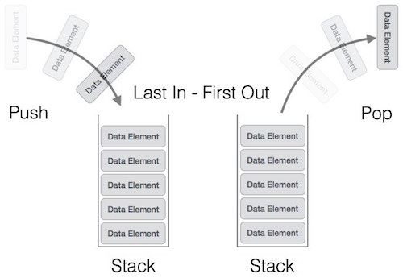

# Algoritmos de Pilha e Fila.

## Pilha

> Uma pilha é uma estrutura de dados que admite remoção de elementos e inserção de novos objetos.  Mais especificamente, 
uma  pilha (= stack)  é uma estrutura sujeita à seguinte regra de operação:  sempre que houver uma remoção, o elemento 
removido é o que está na estrutura há menos tempo.

> Em outras palavras, o primeiro objeto a ser inserido na pilha é o último a ser removido. Essa política é conhecida pela 
sigla LIFO (= Last-In-First-Out).

[Fonte](https://www.ime.usp.br/~pf/algoritmos/aulas/pilha.html)



## Fila

> Uma fila é uma estrutura de dados dinâmica que admite remoção de elementos e inserção de novos objetos.  Mais especificamente, uma  fila  (= queue)  é uma estrutura sujeita à seguinte regra de operação:  sempre que houver uma remoção,
o elemento removido é o que está na estrutura há mais tempo.

> Em outras palavras, o primeiro objeto inserido na fila é também o primeiro a ser removido. Essa política é conhecida pela sigla FIFO (= First-In-First-Out).

[Fonte](https://www.ime.usp.br/~pf/algoritmos/aulas/fila.html)


## Fila com Duas Pilhas 

```
enQueue:
1) Empurre x para stack1 (assumindo que o tamanho das pilhas é ilimitado).
Aqui a complexidade do tempo será O(1).

deQueue:
1) Se ambas as pilhas estiverem vazias, então lança um erro;
2) Se stack2 estiver vazio:
    Enquanto a pilha 1 não estiver vazia, pressione tudo de pilha1 para pilha2.
3) Retira o elemento de stack2 e o retorna.
Aqui a complexidade do tempo será O(n)